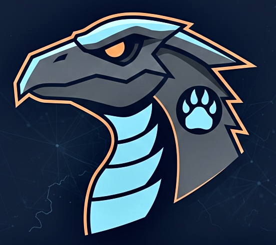

<p align="center">
  
</p>

# LayerClaw

> **Deep Training Observability for PyTorch** - Track, debug, and optimize your ML training runs with ease.

[](https://badge.fury.io/py/layerclaw)
[](https://www.python.org/downloads/)
[](https://github.com/layerclaw/layerclaw/blob/main/LICENSE)
[](https://github.com/psf/black)
[](https://github.com/layerclaw/layerclaw)

## 🎯 What is LayerClaw?

LayerClaw is a lightweight, powerful observability tool designed specifically for PyTorch training runs. It goes beyond simple logging to provide deep insights into your model's training dynamics, gradients, system resources, and potential issues.

### Key Features

- **🔬 Deep Gradient Tracking**: Monitor gradient flow, detect explosions/vanishing gradients
- **📊 Comprehensive Metrics**: Track any metric with automatic checkpointing
- **💾 Efficient Storage**: Hybrid SQLite + Parquet storage for optimal performance
- **🚨 Anomaly Detection**: Automatic detection of training anomalies (NaN/Inf, loss spikes, memory issues)
- **🎨 Beautiful CLI**: Rich terminal UI for exploring and comparing runs
- **🔌 Easy Integration**: Works with vanilla PyTorch, HuggingFace, PyTorch Lightning
- **⚡ Minimal Overhead**: Async writes and smart sampling keep your training fast
- **📈 Run Comparison**: Compare multiple runs to identify what works

## 🚀 Quick Start

### Installation

```bash
pip install layerclaw
```

For GPU support and visualization:
```bash
pip install layerclaw[gpu,viz]
```

For all features including framework integrations:
```bash
pip install layerclaw[all]
```

### Basic Usage

```python
import tracer
import torch
import torch.nn as nn

# Initialize Tracer
tracer.init(
    project="my-awesome-project",
    checkpoint_interval=100,  # Checkpoint every 100 steps
    track_gradients=True,     # Track gradient statistics
)

# Your model
model = YourModel()
optimizer = torch.optim.Adam(model.parameters())

# Attach hooks for gradient tracking
tracer._state.tracer.attach_hooks(model)

# Training loop
for epoch in range(num_epochs):
    for batch in dataloader:
        loss = train_step(model, batch)
        
        # Log metrics
        tracer.log({
            "loss": loss.item(),
            "learning_rate": get_lr(optimizer),
        })
        
        # Increment step (auto-checkpoints)
        tracer.step()

# Finish and save
tracer.finish()
```

### CLI Commands

```bash
# List all training runs
tracer list

# Show detailed information about a run
tracer show my-run-name

# Compare two runs
tracer compare run1 run2 --metric loss

# Detect anomalies automatically
tracer anomalies my-run --auto

# Plot metrics
tracer plot my-run loss

# Export data
tracer plot my-run loss --export metrics.csv
```

## 📖 Documentation

### Core Concepts

#### 1. **Projects and Runs**
- **Project**: A logical grouping of related experiments (e.g., "bert-finetuning")
- **Run**: A single training run with unique configuration

#### 2. **Checkpoints**
Tracer automatically creates checkpoints at configurable intervals, capturing:
- All logged metrics
- Gradient statistics (if enabled)
- System metrics (CPU, memory, GPU)
- Sample data (optional)

#### 3. **Storage**
- **SQLite**: Stores metadata, metrics, and queryable statistics
- **Parquet**: Efficiently stores sample data and large arrays
- **Local-first**: Everything stored locally in `.tracer/` directory

### Configuration Options

```python
tracer.init(
    project="my-project",              # Required: Project name
    run_name="experiment-1",           # Optional: Auto-generated if not provided
    storage_path="./.tracer",          # Storage location
    checkpoint_interval=1000,          # Steps between checkpoints
    capture_samples=5,                 # Number of samples to save per checkpoint
    track_gradients=True,              # Track gradient statistics
    track_system_metrics=True,         # Track CPU/GPU/memory
    gradient_layers=None,              # Specific layers to track (None = all)
    async_writes=True,                 # Use async background writes
    retention_days=30,                 # Auto-cleanup old runs
)
```

## 🔌 Framework Integrations

### HuggingFace Transformers

```python
from tracer.integrations.transformers import TracerCallback

trainer = Trainer(
    model=model,
    args=training_args,
    train_dataset=train_dataset,
    callbacks=[TracerCallback(project="my-huggingface-project")]
)
trainer.train()
```

### PyTorch Lightning

```python
from tracer.integrations.lightning import TracerCallback

trainer = pl.Trainer(
    callbacks=[TracerCallback(project="my-lightning-project")]
)
trainer.fit(model)
```

## 🎯 Use Cases

### 1. **Debugging Training Issues**
```bash
# Detect gradient problems
tracer anomalies my-run --type gradient_explosion

# Find loss spikes
tracer anomalies my-run --type loss_spike

# Check for NaN/Inf
tracer anomalies my-run --type nan_or_inf --auto
```

### 2. **Comparing Experiments**
```bash
# Compare loss curves
tracer compare baseline experiment1 --metric loss

# Find where runs diverged
tracer compare run1 run2
```

### 3. **Monitoring System Resources**
```python
tracer.init(
    project="resource-intensive-training",
    track_system_metrics=True,
)
```

```bash
# View resource usage
tracer show my-run
```

## 🏗️ Architecture

```
tracer/
├── core/              # Core tracking functionality
│   ├── tracer.py      # Main Tracer orchestrator
│   ├── hooks.py       # PyTorch hooks for gradients
│   └── metrics.py     # System metrics collection
├── storage/           # Data persistence
│   ├── backend.py     # SQLite + Parquet storage
│   └── schema.py      # Database schema
├── analysis/          # Analysis and querying
│   ├── query.py       # Query engine
│   └── anomaly.py     # Anomaly detection
├── cli/               # Command-line interface
│   └── main.py        # CLI commands
└── integrations/      # Framework integrations
    ├── transformers.py
    └── lightning.py
```

## 🛣️ Roadmap

- [ ] **v0.2.0**: Web UI for run visualization
- [ ] **v0.3.0**: Distributed training support
- [ ] **v0.4.0**: Remote storage backends (S3, GCS)
- [ ] **v0.5.0**: Real-time monitoring and alerts
- [ ] **v1.0.0**: Production-ready with comprehensive docs

## 🤝 Contributing

We welcome contributions! Please see [CONTRIBUTING.md](CONTRIBUTING.md) for guidelines.

### Development Setup

```bash
# Clone the repository
git clone https://github.com/yourusername/tracer.git
cd tracer

# Create virtual environment
python -m venv venv
source venv/bin/activate  # or `venv\Scripts\activate` on Windows

# Install in development mode with all dependencies
pip install -e ".[all]"

# Install pre-commit hooks
pre-commit install

# Run tests
pytest tests/

# Run with coverage
pytest --cov=tracer tests/
```

## 📄 License

This project is licensed under the MIT License - see the [LICENSE](LICENSE) file for details.

## 🙏 Acknowledgments

- Inspired by tools like Weights & Biases, TensorBoard, and MLflow
- Built on top of amazing open-source projects: PyTorch, PyArrow, Rich, Click

## 📞 Support

- **Issues**: [GitHub Issues](https://github.com/layerclaw/layerclaw/issues)
- **Discussions**: [GitHub Discussions](https://github.com/layerclaw/layerclaw/discussions)

---

<p align="center">
  Made with ❤️ by the LayerClaw team
</p>
